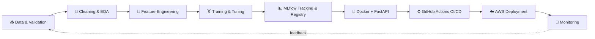

 

---

## 👋 About Me

Final-year **BSc (Hons) Electronic & Computer Science** undergraduate at the **University of Kelaniya** (GPA 3.2/4.0), looking for a **Data Science / Machine Learning / AI-ML Engineering internship**.

I build ML systems across the full lifecycle: **data cleaning → EDA → feature engineering → training → tuning → evaluation → production deployment**.

- 🔬 Researching **Sinhala offensive-text detection & regeneration** with transformers
- 🤖 Building **RAG systems and multi-agent workflows** with LangChain & LangGraph
- ⚙️ Automating **reproducible ML pipelines** with MLflow, Docker, GitHub Actions & AWS
- 🏕️ Off the keyboard: camping, adventure activities and outdoor survival tips
- 🤝 Always open to collaborating on tech projects and open source

---

## 📈 Highlights

| 🎯 82% | 🔍 35% | 🚀 6+ | 🧪 1 |
|:---:|:---:|:---:|:---:|
| test accuracy on benchmarked loan-approval classifier | lift in document retrieval accuracy on a production RAG system | end-to-end ML projects delivered | published-style NLP research project in progress |

---

## 🛠️ Tech Stack

**Languages**

**Machine Learning & Data Science**

**NLP & Generative AI**

**MLOps, Backend & Cloud**

**Databases**

---

## 🔬 Research

### 🇱🇰 Sinhala Offensive Text Detection & Regeneration System
*Undergraduate Researcher · University of Kelaniya*

`PyTorch` `XLM-RoBERTa` `mT5` `Transformers` `Hugging Face` `Explainable AI`

- Fine-tuning **XLM-RoBERTa** for offensive-language classification and **mT5** for offensive-to-neutral text regeneration, targeting Sinhala content moderation at scale.
- Built and annotated custom Sinhala datasets alongside the public **SOLD** benchmark, using class-imbalance handling and stratified splits for informal, code-mixed text.
- Evaluating with accuracy, precision, recall, F1 and **semantic-similarity** metrics so regenerated text keeps its original meaning.
- Applying **Explainable AI** to expose token-level drivers of predictions for error analysis.

---

## 🚀 Featured Projects

### 🏦 Loan Approval Prediction: End-to-End MLOps Pipeline
`Scikit-learn` `XGBoost` `LightGBM` `MLflow` `FastAPI` `Pydantic` `Docker` `GitHub Actions` `AWS EC2/ECR/S3/CloudWatch` `Pytest`
- Reached **82% test accuracy** by benchmarking RandomForest, XGBoost and LightGBM in a shared pipeline with cross-validation and hyperparameter tuning.
- Logged every run in **MLflow** and programmatically promoted the best model to the registry.
- Prevented schema-drift failures with **Pydantic** validation across ingestion, transformation and serving.
- Cut deployment to a **single push**: CI/CD builds versioned Docker images, publishes to ECR and deploys to EC2.

### 🤖 Agentic AI Chatbot: Production RAG System
`LangChain` `LangGraph` `FastAPI` `Streamlit` `Gemini` `Groq` `Pinecone` `LangSmith` `Docker` `AWS EC2`
- Improved retrieval accuracy by **35%** by tuning chunking, embeddings and vector search over a Pinecone index.
- FastAPI backend with conversational memory, tool/function calling and **multi-provider LLM routing** (Gemini + Groq).
- Streamlit UI for real-time document Q&A; **LangSmith** tracing to diagnose latency and hallucinations.

### 🎓 Student Performance Indicator: End-to-End ML Pipeline
`Scikit-learn` `Pandas` `Flask` `Docker` `AWS` `GitHub Actions`
- Modular pipeline covering ingestion, cleaning, EDA, feature engineering and multi-model regression.
- Correlation analysis to find the strongest performance predictors and improve interpretability.
- Served via a Flask REST API, containerized and continuously deployed to AWS.

### ✈️ Multi-Agent Travel Planner
`LangGraph` `LangChain` `FastAPI` `Streamlit` `Tavily Search` `LangSmith` `Render`
- Specialized agents for search, budgeting and scheduling generate a full itinerary from one prompt.
- Grounded outputs with live **Tavily** search data to reduce hallucinated recommendations.

### ✋ Hand Gesture Brightness Control: Computer Vision
`OpenCV` `MediaPipe` `NumPy`
- Real-time tracking of **21 hand landmarks** per frame, mapping pinch distance to a 0-100 brightness scale for up to two hands.

---

## 🧭 How I Ship ML

---

## 🎓 Education & Certifications

**BSc (Hons) Electronic and Computer Science**, University of Kelaniya, Sri Lanka · Expected 2027 · GPA 3.2/4.0
*Coursework: Machine Learning, Data Structures & Algorithms, Statistics & Probability, Database Systems, OOP, Computer Networks*

- 🏅 AWS Educate: Machine Learning Foundations
- 🏅 AWS Educate: Introduction to Cloud 101
- 🏅 MLOps for Beginners: Applied Project Course
- 🏅 Retrieval-Augmented Generation (RAG) Bootcamp
- 🏅 Running LLMs on Docker: Applied Project Course

**Languages:** 🇬🇧 English (Professional Working) · 🇱🇰 Sinhala (Native)

---

## 📊 GitHub Stats

---

### 📬 Let's build something together

I'm looking for **Data Science / ML / AI Engineering internships**. Reach out on [LinkedIn](https://linkedin.com/in/daminthadeshanwijekoon) or [email](mailto:daminthadeshan01@gmail.com).

